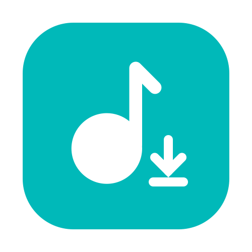

# My Projects

## Application

<table style="text-align: left">
  <thead>
    <tr>
      <th style="text-align: center;">Icon</th>
      <th>Name</th>
      <th>Components</th>
      <th>Framework</th>
      <th>Platform</th>
      <th>Detail</th>
    </tr>
  </thead>
  <tbody>
    <tr>
      <td rowspan="3"></td>
      <td rowspan="2"><a href="https://github.com/Zhoucheng133/netPlayer-Next">netPlayer</a></td>
      <td><a href="https://github.com/Zhoucheng133/netPlayer-Next">App</a></td>
      <td rowspan="2">Flutter</td>
      <td rowspan="2"></td>
      <td rowspan="3">Subsonic & Navidrome based Music Player</td>
    </tr>
    <tr>
      <td><del><a href="https://github.com/Zhoucheng133/netPlayer-mini-kit">Lyric Kit</a></del></td>
    </tr>
    <tr>
      <td><a href="https://github.com/Zhoucheng133/netPlayer-Mobile">netPlayer Mobile</a></td>
      <td>/</td>
      <td>Flutter</td>
      <td></td>
    </tr>
    <tr>
      <td rowspan="3"></td>
      <td rowspan="3"><a href="https://github.com/Zhoucheng133/Sharer-App">Sharer</a></td>
      <td><a href="https://github.com/Zhoucheng133/Sharer-App">App</a></td>
      <td>Flutter</td>
      <td rowspan="3"></td>
      <td rowspan="3">File Sharing Tool</td>
    </tr>
    <tr>
      <td><a href="https://github.com/Zhoucheng133/Sharer-Core">Core</a></td>
      <td>Gin</td>
    </tr>
    <tr>
      <td><a href="https://github.com/Zhoucheng133/Sharer-Web">WebUI</a></td>
      <td>Vue</td>
    </tr>
    <tr>
      <td rowspan="2"></td>
      <td rowspan="2"><a href="https://github.com/Zhoucheng133/DAV-Server">DAV Server</a></td>
      <td><a href="https://github.com/Zhoucheng133/DAV-Server">App</a></td>
      <td>Flutter</td>
      <td rowspan="2"></td>
      <td rowspan="2">WebDAV Server</td>
    </tr>
    <tr>
      <td><a href="https://github.com/Zhoucheng133/DAV-Core">Core</a></td>
      <td>Go</td>
    </tr>
    <tr>
      <td></td>
      <td><a href="https://github.com/Zhoucheng133/BitFlow">BitFlow</a></td>
      <td>/</td>
      <td>Flutter</td>
      <td>
        
      </td>
      <td>qBittorrent & Aria Cilent</td>
    </tr>
    <tr>
      <td rowspan="2"></td>
      <td rowspan="2"><a href="https://github.com/Zhoucheng133/Server-Express">Server Express</a></td>
      <td><a href="https://github.com/Zhoucheng133/Server-Express">App</a></td>
      <td>Flutter</td>
      <td rowspan="2"></td>
      <td rowspan="2">SFTP Client</td>
    </tr>
    <tr>
      <td><a href="https://github.com/Zhoucheng133/Server-Express-Core">Core</a></td>
      <td>Rust</td>
    </tr>
    <tr>
      <td rowspan="3"></td>
      <td><a href="https://github.com/Zhoucheng133/MusicDL-PyQt">MusicDL GUI (PyQt ver.)</a></td>
      <td>/</td>
      <td>PyQt</td>
      <td></td>
      <td rowspan="3">Music Download Tool</td>
    </tr>
    <tr>
      <td rowspan="2"><a href="https://github.com/Zhoucheng133/MusicDL-PyQt">MusicDL GUI (Tauri ver.)</a></td>
      <td>App</td>
      <td>Tauri</td>
      <td rowspan="2"></td>
    </tr>
    <tr>
      <td>Core</td>
      <td>Python</td>
    </tr>
    <tr>
      <td rowspan="2"></td>
      <td rowspan="2"><a href="https://github.com/Zhoucheng133/Gamma-Setter">Gamma Setter</a></td>
      <td><a href="https://github.com/Zhoucheng133/Gamma-Setter">App</a></td>
      <td>Flutter</td>
      <td rowspan="2"></td>
      <td rowspan="2">Monitor's Gamma Adjust Tool</td>
    </tr>
    <tr>
      <td><a href="https://github.com/Zhoucheng133/Gamma-Setter-Core">Core</a></td>
      <td>Rust</td>
    </tr>
    <tr>
    <tr>
      <td rowspan="2"></td>
      <td rowspan="2"><a href="https://github.com/Zhoucheng133/toWebp">toWebp</a></td>
      <td><a href="https://github.com/Zhoucheng133/toWebp">App</a></td>
      <td>Tauri</td>
      <td rowspan="2"></td>
      <td rowspan="2">Convert Image to Webp Tool</td>
    </tr>
    <tr>
      <td><a href="https://github.com/Zhoucheng133/toWebp-Core">Core</a></td>
      <td>Go</td>
    </tr>
    <tr>
      <td></td>
      <td><a href="https://github.com/Zhoucheng133/One-Loop">One Loop</a></td>
      <td>/</td>
      <td>Flutter</td>
      <td></td>
      <td>Loop an Audio</td>
    </tr>
    <tr>
      <td></td>
      <td><a href="https://github.com/Zhoucheng133/GPS-Tracker">GPS Tracker</a></td>
      <td>/</td>
      <td>Flutter</td>
      <td></td>
      <td>A GPS Tool</td>
    </tr>
    <tr>
      <td></td>
      <td><a href="https://github.com/Zhoucheng133/Deface-GUI">Deface GUI</a></td>
      <td>/</td>
      <td>Tauri</td>
      <td></td>
      <td>Deface GUI Helper</td>
    </tr>
    <tr>
      <td></td>
      <td><a href="https://github.com/Zhoucheng133/Whisper-GUI">Whisper GUI</a></td>
      <td>/</td>
      <td>Flutter</td>
      <td></td>
      <td>Whisper GUI Helper</td>
    </tr>
    <tr>
      <td rowspan="2"></td>
      <td rowspan="2"><a href="https://github.com/Zhoucheng133/Photo-Archiver">PhotoArchiver</a></td>
      <td><a href="https://github.com/Zhoucheng133/Photo-Archiver">App</a></td>
      <td>Flutter</td>
      <td rowspan="2"></td>
      <td rowspan="2">Make Photos Grouped by Datetime</td>
    </tr>
    <tr>
      <td><a href="https://github.com/Zhoucheng133/PhotoArchiver-Core">Core</a></td>
      <td>Go</td>
    </tr>
    <tr>
      <td rowspan="2"></td>
      <td rowspan="2"><a href="https://github.com/Zhoucheng133/GitPack">GitPack</a></td>
      <td><a href="https://github.com/Zhoucheng133/GitPack">App</a></td>
      <td>Flutter</td>
      <td rowspan="2"></td>
      <td rowspan="2">Pack Git Repo Without Ignores</td>
    </tr>
    <tr>
      <td><a href="https://github.com/Zhoucheng133/GitPack-Core">Core</a></td>
      <td>Go</td>
    </tr>
    <tr>
      <td rowspan="2"></td>
      <td rowspan="2"><a href="https://github.com/Zhoucheng133/EXIF-Helper">EXIF Helper</a></td>
      <td><a href="https://github.com/Zhoucheng133/EXIF-Helper">App</a></td>
      <td>Flutter</td>
      <td rowspan="2"></td>
      <td rowspan="2">EXIF ​​Watermark Adding Tool</td>
    </tr>
    <tr>
      <td><a href="https://github.com/Zhoucheng133/EXIF-Helper-Core">Core</a></td>
      <td>Go</td>
    </tr>
    <tr>
      <td rowspan="2"></td>
      <td rowspan="2"><a href="https://github.com/Zhoucheng133/HEIC-Converter">HEIC Converter</a></td>
      <td><a href="https://github.com/Zhoucheng133/HEIC-Converter">App</a></td>
      <td>Tauri</td>
      <td rowspan="2"></td>
      <td rowspan="2">HEIC & HEIF Convert Tool</td>
    </tr>
    <tr>
      <td><a href="https://github.com/Zhoucheng133/HEIC-Converter-Core">Core</a></td>
      <td>Python</td>
    </tr>
    <tr>
      <td></td>
      <td><a href="https://github.com/Zhoucheng133/Subs">Subs</a></td>
      <td>/</td>
      <td>Flutter</td>
      <td></td>
      <td>Multi Subtitles Burning Tool</td>
    </tr>
    <tr>
      <td></td>
      <td><a href="https://github.com/Zhoucheng133/pyftp-GUI">pyftp GUI</a></td>
      <td>/</td>
      <td>Flutter</td>
      <td></td>
      <td>pyftpdlib GUI Helper</td>
    </tr>
    <tr>
      <td></td>
      <td><a href="https://github.com/Zhoucheng133/FFmpegGUI">FFmpeg GUI</a></td>
      <td>/</td>
      <td>Flutter</td>
      <td></td>
      <td>FFmpeg GUI Helper</td>
    </tr>
    <tr>
      <td></td>
      <td><a href="https://github.com/Zhoucheng133/EasyChat">EasyChat</a></td>
      <td>/</td>
      <td>Flutter</td>
      <td></td>
      <td>OpenAPI Client</td>
    </tr>
    <tr>
      <td rowspan="2"></td>
      <td rowspan="2"><del><a href="https://github.com/Zhoucheng133/virtual-directory">Virtual Directory</a></del></td>
      <td><del><a href="https://github.com/Zhoucheng133/virtual-directory">App</a></del></td>
      <td>Electron</td>
      <td rowspan="2"></td>
      <td rowspan="2">[Split to Sharer and DAV Server]</td>
    </tr>
    <tr>
      <td><del><a href="https://github.com/Zhoucheng133/virtual-dir-page">WebUI</a></del></td>
      <td>Vue</td>
    </tr>
    <tr>
      <td rowspan=2></td>
      <td><del><a href="https://github.com/Zhoucheng133/AriaUI">Aria UI</a></del></td>
      <td rowspan=2>/</td>
      <td rowspan=2>Flutter</td>
      <td rowspan=2></td>
      <td rowspan=2>[Merge to BitFlow]</td>
    </tr>
    <tr>
      <td><del><a href="https://github.com/Zhoucheng133/Aria-Remote">Aria Remote</a></del></td>
    </tr>
    <tr>
      <td></td>
      <td><a href="https://github.com/Zhoucheng133/Anime-Update-Panel"><del>Anime Update Panel</del></a></td>
      <td>/</td>
      <td>Flutter</td>
      <td></td>
      <td>[Merge to Anime Helper]</td>
    </tr>
    <tr>
      <td style="text-align: center;">/</td>
      <td><a href="https://github.com/Zhoucheng133/CuteHttpFileServer-GUI"><del>CHFS-GUI</del></a></td>
      <td>/</td>
      <td>Flutter</td>
      <td></td>
      <td>[Split to Sharer and DAV Server]</td>
    </tr>
  </tbody>
</table>

## Service
<table style="text-align: left">
  <thead>
    <tr>
      <th style="text-align: center;">Icon</th>
      <th>Name</th>
      <th>Components</th>
      <th>Framework</th>
      <th>Detail</th>
    </tr>
  </thead>
  <tbody>
    <tr>
      <td rowspan="2"></td>
      <td rowspan="2"><a href="https://github.com/Zhoucheng133/Anime-Helper">Anime Helper</a></td>
      <td><a href="https://github.com/Zhoucheng133/Anime-Helper">Server</a></td>
      <td>ElysiaJS</td>
      <td rowspan="2">Animation Follow & Download Tool</td>
    </tr>
    <tr>
      <td><a href="https://github.com/Zhoucheng133/Anime-Helper-UI">WebUI</a></td>
      <td>Vue</td>
    </tr>
    <tr>
      <td rowspan="2"></td>
      <td rowspan="2"><a href="https://github.com/Zhoucheng133/Jackett-Helper">Jackett Helper</a></td>
      <td><a href="https://github.com/Zhoucheng133/Jackett-Helper">Server</a></td>
      <td>ElysiaJS</td>
      <td rowspan="2">Add Task to Aria from Jackett</td>
    </tr>
    <tr>
      <td><a href="https://github.com/Zhoucheng133/Jackett-Helper-Web">WebUI</a></td>
      <td>Vue</td>
    </tr>
    <tr>
      <td rowspan="2"></td>
      <td rowspan="2"><a href="https://github.com/Zhoucheng133/SHT-Viz">SHT Viz</a></td>
      <td><a href="https://github.com/Zhoucheng133/SHT-Viz">Server</a></td>
      <td>FastAPI</td>
      <td rowspan="2">SHT-based Environmental Monitoring System</td>
    </tr>
    <tr>
      <td><a href="https://github.com/Zhoucheng133/SHT-Viz-Web">WebUI</a></td>
      <td>Vue</td>
    </tr>
    <tr>
      <td rowspan="2" style="text-align: center;">/</td>
      <td rowspan="2"><a href="https://github.com/Zhoucheng133/Index-Page">Index Page</a></td>
      <td><a href="https://github.com/Zhoucheng133/Index-Page-Core">Server</a></td>
      <td>Gin</td>
      <td rowspan="2">Server Index Page</td>
    </tr>
    <tr>
      <td><a href="https://github.com/Zhoucheng133/Index-Page">WebUI</a></td>
      <td>Vue</td>
    </tr>
    <tr>
      <td rowspan="2" style="text-align: center;">/</td>
      <td rowspan="2"><a href="https://github.com/Zhoucheng133/Monitor">Monitor</a></td>
      <td><a href="https://github.com/Zhoucheng133/Monitor">Server</a></td>
      <td>Spring (Kotlin)</td>
      <td rowspan="2">System Monitor Page</td>
    </tr>
    <tr>
      <td><a href="https://github.com/Zhoucheng133/Monitor-UI">WebUI</a></td>
      <td>Vue</td>
    </tr>
    <tr>
      <td rowspan="2" style="text-align: center;">/</td>
      <td rowspan="2"><del><a href="https://github.com/Zhoucheng133/Mikan-Helper">Mikan Helper</a></del></td>
      <td><del><a href="https://github.com/Zhoucheng133/Mikan-Helper">Server</a></del></td>
      <td>Flask</td>
      <td rowspan="2">[Merge to Anime Helper]</td>
    </tr>
    <tr>
      <td><del><a href="https://github.com/Zhoucheng133/Anime-Helper-Web">WebUI</a></del></td>
      <td>React</td>
    </tr>
  </tbody>
</table>

## Script
<table style="text-align: left">
  <thead>
    <tr>
      <th>Name</th>
      <th>Framework</th>
      <th>Detail</th>
    </tr>
  </thead>
  <tbody>
    <tr>
      <td><a href="https://github.com/Zhoucheng133/Aria-Linker">Aria Linker</a></td>
      <td>JavaScript</td>
      <td>Tampermonkey Script that Add Task to Aria</td>
    </tr>
    <tr>
      <td><a href="https://github.com/Zhoucheng133/qBit-Linker">qBit Linker</a></td>
      <td>JavaScript</td>
      <td>Tampermonkey Script that Add Task to qBit</td>
    </tr>
    <tr>
      <td><a href="https://github.com/Zhoucheng133/Live-BG">LiveBG</a></td>
      <td>Gin & Vue</td>
      <td>netPlayer OBS Live Background</td>
    </tr>
    <tr>
      <td><a href="https://github.com/Zhoucheng133/DAV-with-Docker">DAV with Docker</a></td>
      <td>Go</td>
      <td>Deploy WebDAV Server with Docker</td>
    </tr>
  </tbody>
</table>