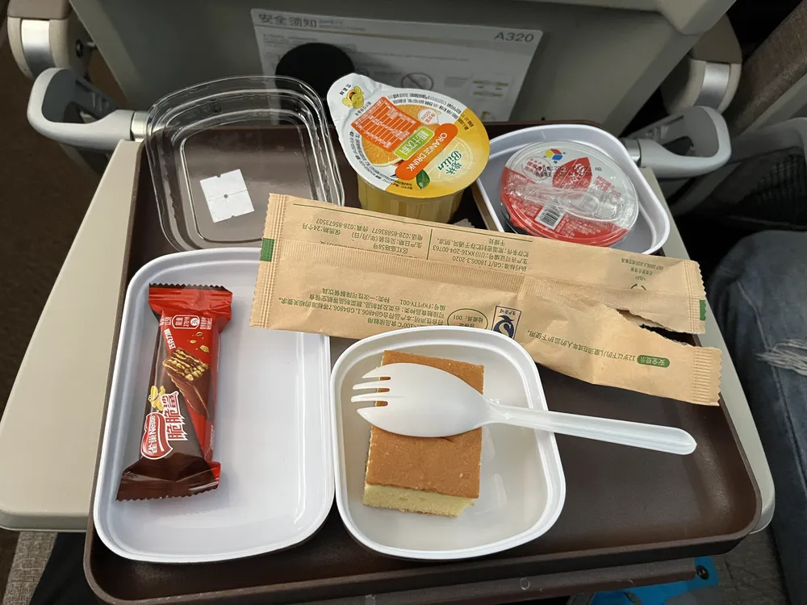
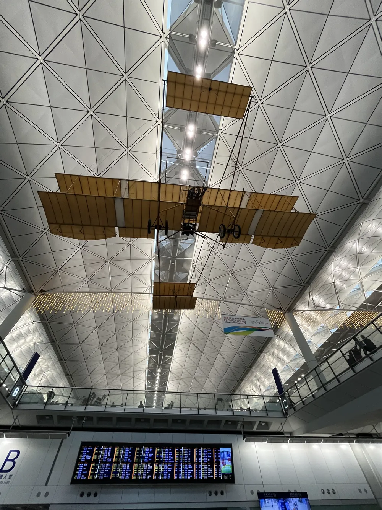
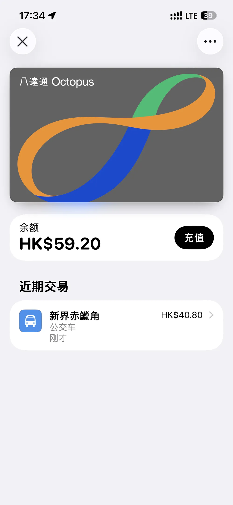
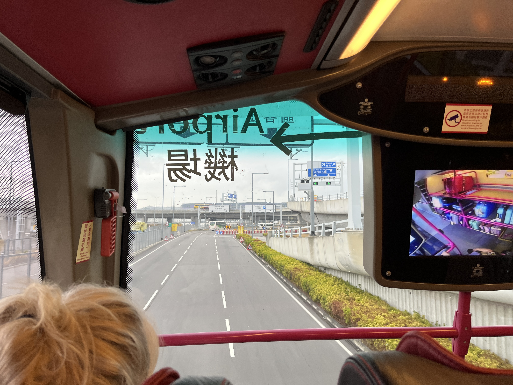
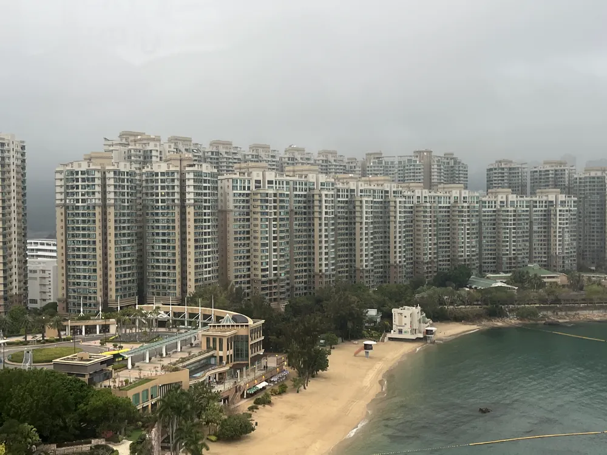
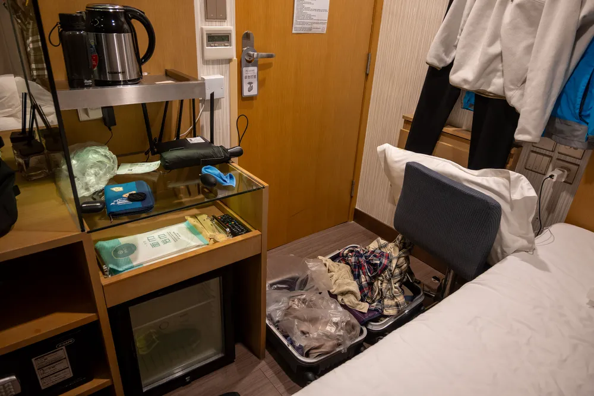
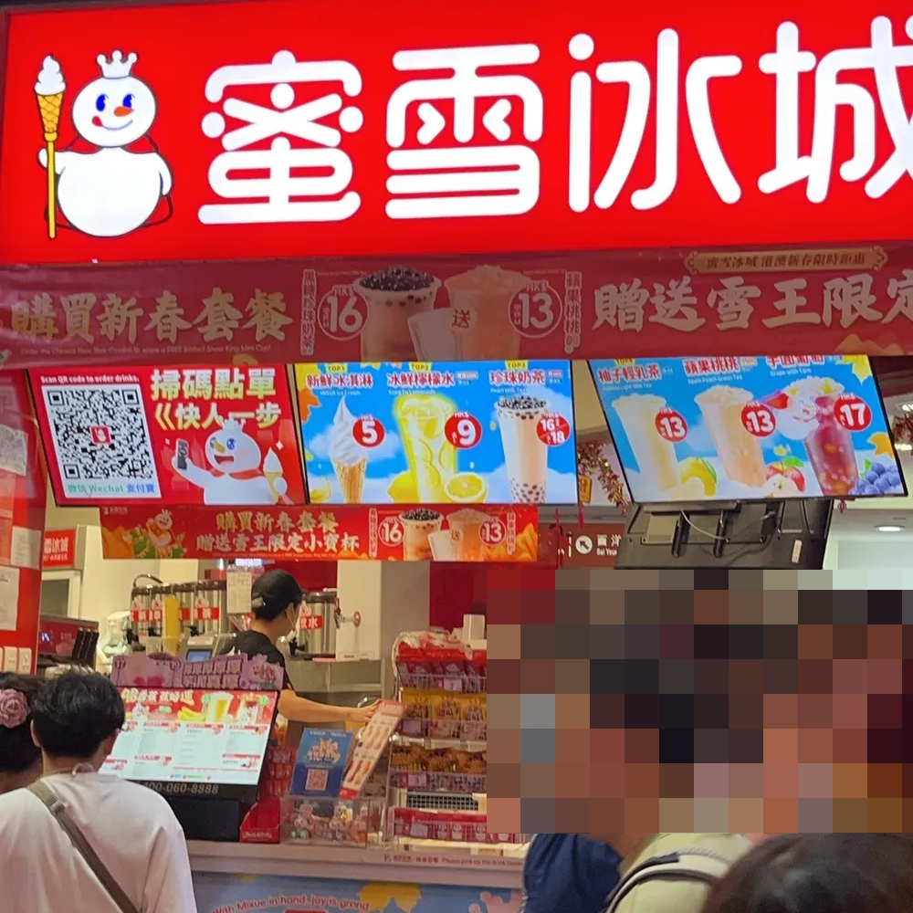

这次去香港坐的是东方航空（作为穷游党也算奢侈一次没有坐廉价航空），因为是下午三点的飞机从南京禄口机场飞的，所以我提前在南京南站吃了午饭

结果这趟飞机居然有午饭（牛肉面）……我实在没有兴趣再吃一顿了，所以我就直接没要，就当吃点午后点心吧

抵达香港机场就是一股热浪袭来，我拿完行李立马把外套塞行李箱里。另外值得一提就是，来到香港才知道香港所谓的“夺命扶梯”是什么，香港扶梯应该都是配备无障碍设计，两头都有哔哔哔的响声，说真的有点吵……

香港机场进门有一个老飞机挂在空中，这也算是香港机场的一个特色了

香港机场有个铁路叫做机场快线，但是这条线非常贵（俗称抢钱快线），并且去我订的宾馆还得转几次车，所以我决定直接坐公交车  
不过没想到这里的机场公交车也是巨贵……迄今为止我都没有坐过那么贵的公交车

不过这趟公交车设计的还是挺好的，这是一个双层巴士，一楼有前面有一个巨大的行李放置处，并且有摄像头，这样在二楼可以通过显示屏看到你的行李

去往市区的路上就可以看到香港特色的住宅楼，这楼间距在内地估计都不合规定

在香港，理所当然的，我住宿的地方空间也是非常狭小，我只能说幸好我带的是一个小的行李箱（24寸的行李箱），因此凑活还可以展开，再大的行李箱我估计都没法完全打开

另外值得一提，我住宿的旅馆还是挺有趣的，一方面一层楼只有三间房间（可见这栋楼占地面积极小），另外这里有一些电器应该是从内地买的，路由器都是直接插在转换器上的哈哈哈（虽然我自己带了转换器）

顺带一提，我去中环买镜头的时候，刚好旁边有一个蜜雪冰城，我顺带看了一眼价格：

好吧，有够贵的……并且感觉在香港买蜜雪冰城的都是内地人

准备回去的时候下雨了，虽然我之前出去旅游都是晴天娃娃属性的（自封的哈哈哈哈），基本不会下雨，但是这次好像失效了